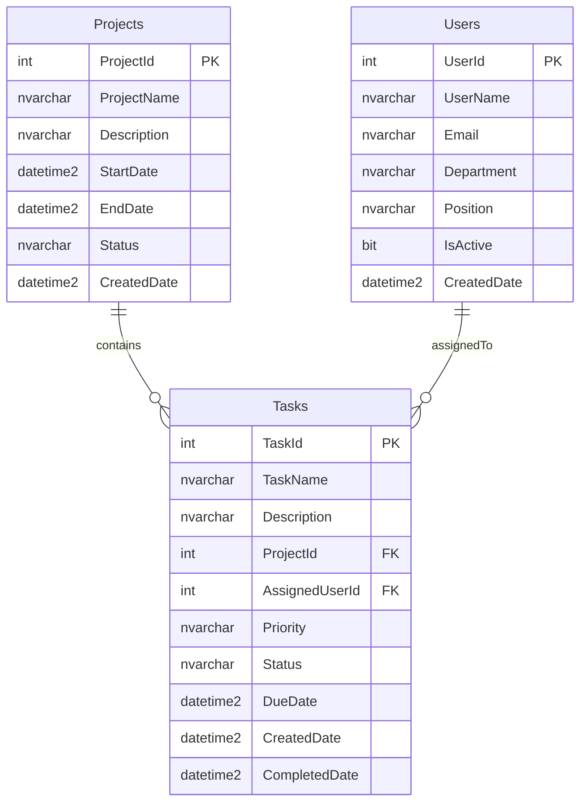

# TaskTracker 任務追蹤系統 v2.0

<div align="center">


**基於 ASP.NET Core MVC 的企業級任務追蹤管理系統**

*期末報告專案 - 完整展示 CRUD 操作與資料庫關聯設計*

**🎉 v2.0 更新：已完成全功能測試，成功遷移至 Docker SQL Server**

</div>

---

## 📋 專案概覽

TaskTracker 是一個功能完整的任務追蹤管理系統，專為展示現代化 Web 開發技術而設計。**已完成所有功能測試並成功部署**。

### 🎯 核心功能

- **完整 CRUD 操作** - 專案、使用者、任務的建立、讀取、更新、刪除
- **資料庫關聯設計** - 一對多、多對一關聯展示
- **響應式 UI** - Tailwind CSS 現代化介面
- **Docker 容器化** - SQL Server 2022 容器部署
- **Entity Framework Core** - 完整 ORM 實作

---

## 🚀 快速開始

### 系統需求

- **.NET:** 8.0 或更高版本
- **Node.js:** 18.0 或更高版本
- **Docker:** Docker Desktop 或 Docker Engine
- **作業系統:** Windows, macOS, Linux

### 安裝步驟

#### 1. 克隆專案
```bash
git clone <repository-url>
cd SmartPlanner2
```

#### 2. 啟動 SQL Server 容器
```bash
# Windows
.\start-sqlserver.bat

# macOS/Linux
chmod +x start-sqlserver.sh
./start-sqlserver.sh

# 或手動啟動
docker-compose up -d
```

#### 3. 設定專案
```bash
cd TaskTracker

# 還原 .NET 依賴項
dotnet restore

# 建立資料庫遷移
dotnet ef migrations add InitialCreate
dotnet ef database update

# 安裝 Node.js 依賴項
npm install

# 編譯 Tailwind CSS
npx tailwindcss -i ./wwwroot/css/input.css -o ./wwwroot/css/output.css
```

#### 4. 啟動應用程式
```bash
dotnet run
```

#### 5. 瀏覽應用程式
開啟瀏覽器：`https://localhost:5166`

### 💾 SQL Server 連接資訊

- **伺服器：** `localhost,1433`
- **使用者名稱：** `sa`
- **密碼：** `TaskTracker123!`
- **開發資料庫：** `TaskTrackerDB_Dev`
- **生產資料庫：** `TaskTrackerDB`

---

## 🏗️ 技術架構

### 技術棧

| 技術 | 版本 | 用途 |
|------|------|------|
| ASP.NET Core MVC | 8.0 | 後端框架 |
| Entity Framework Core | 9.0.5 | ORM 框架 |
| SQL Server | 2022 Express | 資料庫 |
| Docker | Latest | 容器化 |
| Tailwind CSS | 4.1.8 | CSS 框架 |
| C# | 12.0 | 程式語言 |

### 資料庫設計



### 專案結構

```
SmartPlanner2/
├── docker-compose.yml              # Docker 配置
├── start-sqlserver.bat/.sh         # SQL Server 啟動腳本
├── TaskTracker/
│   ├── Controllers/                # MVC 控制器
│   ├── Models/                     # 資料模型
│   ├── Views/                      # Razor 視圖
│   ├── Data/                       # EF DbContext
│   ├── Migrations/                 # 資料庫遷移
│   ├── wwwroot/                    # 靜態檔案
│   ├── appsettings.json           # 應用程式配置
│   └── Program.cs                 # 應用程式進入點
└── docs/                          # 詳細文件
```

---

## 🎯 核心功能

### CRUD 操作
- **專案管理** - 建立、編輯、查看、刪除專案
- **使用者管理** - 管理團隊成員與角色
- **任務管理** - 完整的任務生命週期管理

### 資料庫關聯
- **專案 → 任務** - 一對多關聯查詢
- **使用者 → 任務** - 一對多關聯查詢
- **下拉選單** - 動態載入關聯資料

### UI/UX 特色
- **響應式設計** - 支援桌面、平板、手機
- **現代化介面** - Tailwind CSS 設計系統
- **直觀操作** - 簡潔的使用者體驗

---

## 🛠️ 開發指南

### 開發模式
```bash
# 熱重載開發
dotnet watch run

# Tailwind CSS 監控
npx tailwindcss -i ./wwwroot/css/input.css -o ./wwwroot/css/output.css --watch
```

### 資料庫操作
```bash
# 連接 SQL Server
docker exec -it tasktracker-sqlserver /opt/mssql-tools/bin/sqlcmd -S localhost -U sa -P TaskTracker123!

# Entity Framework 遷移
dotnet ef migrations add <MigrationName>
dotnet ef database update
```

### Docker 管理
```bash
# 檢查容器狀態
docker-compose ps

# 查看日誌
docker-compose logs sqlserver

# 重啟服務
docker-compose restart
```

---

## 🚨 常見問題

### Docker 相關
**Q: 容器無法啟動？**
```bash
# 檢查 Docker 狀態
docker version
# 檢查埠號佔用
netstat -an | grep 1433
```

**Q: SQL Server 連接失敗？**
```bash
# 檢查容器狀態
docker-compose ps
# 查看容器日誌
docker-compose logs sqlserver
```

### 應用程式相關
**Q: 遷移失敗？**
```bash
# 清除並重建遷移
rm -rf Migrations/
dotnet ef migrations add InitialCreate
dotnet ef database update
```

**Q: Tailwind CSS 樣式未載入？**
```bash
# 重新編譯 CSS
npx tailwindcss -i ./wwwroot/css/input.css -o ./wwwroot/css/output.css
```

---

## 📚 學習資源

- [ASP.NET Core MVC 官方文件](https://docs.microsoft.com/aspnet/core/mvc/)
- [Entity Framework Core 指南](https://docs.microsoft.com/ef/core/)
- [SQL Server Docker 文件](https://hub.docker.com/_/microsoft-mssql-server)
- [Tailwind CSS 文件](https://tailwindcss.com/docs)

---

## 🤝 專案特色

本專案展示了完整的現代化 Web 開發技能：

- **完整 CRUD 操作** - 展示資料庫基本操作
- **關聯資料設計** - 多表關聯查詢實作
- **容器化部署** - Docker SQL Server 整合
- **現代化 UI** - Tailwind CSS 響應式設計
- **程式碼品質** - 清晰的架構和註解

---

## 📖 詳細文件

如需更詳細的資訊，請參考以下文件：

- 📘 **[開發指南](docs/DEVELOPMENT.md)** - 詳細的開發環境設定與最佳實務
- 🔧 **[疑難排解](docs/TROUBLESHOOTING.md)** - 完整的問題解決方案
- 🐳 **[部署指南](docs/DEPLOYMENT.md)** - Docker 詳細部署與管理
- 📊 **[資料庫遷移指南](資料庫遷移指南.md)** - SQLite 到 SQL Server 遷移說明

---

## 📄 授權條款

本專案採用 MIT 授權條款 - 詳見 [LICENSE](LICENSE) 檔案

---

<div align="center">

**TaskTracker v2.0** - 展示現代化 Web 開發技術的完整專案

Made with ❤️ using ASP.NET Core, Entity Framework, SQL Server & Docker

**祝您開發愉快！** 🚀

</div> 