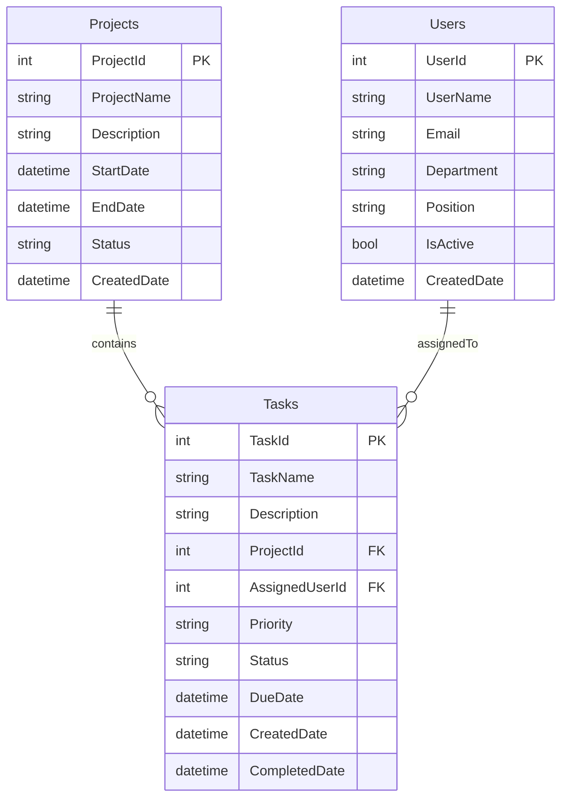

# TaskTracker 任務追蹤系統

<div align="center">


**基於 ASP.NET Core MVC 的企業級任務追蹤管理系統**

*期末報告專案 - 完整展示 CRUD 操作與資料庫關聯設計*

</div>

---

## 📋 專案概覽

TaskTracker 是一個功能完整的任務追蹤管理系統，專為展示現代化 Web 開發技術而設計。本專案重點在於：

- ⭐⭐⭐ **完整的 CRUD 操作** - Create, Read, Update, Delete
- ⭐⭐ **資料庫關聯設計** - 一對多、多對一關聯展示
- ⭐ **Entity Framework Core** 實作
- ⭐ **現代化 UI 設計** - Tailwind CSS 響應式介面

### 🎯 核心功能

- **專案管理** - 建立、編輯、查看、刪除專案
- **使用者管理** - 管理團隊成員與負責人
- **任務管理** - 完整的任務生命週期管理
- **關聯查詢** - 跨表關聯資料展示
- **響應式 UI** - 適配各種裝置的現代化介面

---

## 🚀 快速開始

### 系統需求

- **作業系統：** Windows, macOS, Linux
- **.NET：** .NET 8.0 或更高版本
- **Node.js：** 18.0 或更高版本 (用於 Tailwind CSS)
- **資料庫：** SQLite (內建，無需額外安裝)

### 安裝步驟

#### 1. 克隆專案
```bash
git clone <repository-url>
cd SmartPlanner2
```

#### 2. 還原 .NET 依賴項
```bash
cd TaskTracker
dotnet restore
```

#### 3. 安裝前端依賴項
```bash
# 安裝 Tailwind CSS
npm install
```

#### 4. 編譯 Tailwind CSS
```bash
# 開發模式 (監控變化)
npx tailwindcss -i ./wwwroot/css/input.css -o ./wwwroot/css/output.css --watch

# 或一次性編譯
npx tailwindcss -i ./wwwroot/css/input.css -o ./wwwroot/css/output.css
```

#### 5. 啟動應用程式
```bash
dotnet run
```

#### 6. 瀏覽應用程式
開啟瀏覽器並導航至：`https://localhost:5166`

---

## 🏗️ 專案架構

### 技術棧

| 技術 | 版本 | 用途 |
|------|------|------|
| ASP.NET Core MVC | 8.0 | 後端框架 |
| Entity Framework Core | 9.0.5 | ORM 框架 |
| SQLite | - | 資料庫 |
| Tailwind CSS | 4.1.8 | CSS 框架 |
| C# | 12.0 | 程式語言 |

### 資料庫設計



### 檔案結構

```
TaskTracker/
├── Controllers/           # MVC 控制器
│   ├── HomeController.cs
│   ├── ProjectsController.cs  ⭐ CRUD 操作
│   ├── UsersController.cs     ⭐ CRUD 操作
│   └── TasksController.cs     ⭐ CRUD 操作 + 關聯
├── Models/               # 資料模型
│   ├── Project.cs        ⭐ 專案實體
│   ├── User.cs          ⭐ 使用者實體
│   └── TaskItem.cs      ⭐ 任務實體
├── Data/                # 資料存取層
│   └── TaskTrackerContext.cs  ⭐ EF Core DbContext
├── Views/               # Razor 視圖
│   ├── Home/
│   ├── Projects/        ⭐ 專案 CRUD 頁面
│   ├── Users/          ⭐ 使用者 CRUD 頁面
│   ├── Tasks/          ⭐ 任務 CRUD 頁面
│   └── Shared/         # 共用佈局
├── wwwroot/            # 靜態檔案
│   ├── css/
│   ├── js/
│   └── lib/
├── ViewModels/         # 視圖模型
├── appsettings.json    # 應用程式設定
├── Program.cs          # 應用程式進入點
├── package.json        # 前端依賴項
└── tailwind.config.js  # Tailwind 設定
```

---

## 🎯 功能說明

### 核心 CRUD 功能

#### 1. 專案管理 (Projects) ⭐
- **新增專案** - 建立新的專案項目
- **專案列表** - 卡片式展示所有專案
- **專案詳情** - 顯示專案資訊及相關任務
- **編輯專案** - 修改專案資訊和狀態
- **刪除專案** - 安全刪除（檢查關聯）

#### 2. 使用者管理 (Users) ⭐
- **新增使用者** - 註冊新的團隊成員
- **使用者列表** - 展示所有使用者及任務統計
- **使用者詳情** - 顯示使用者資訊及負責任務
- **編輯使用者** - 修改使用者資料
- **停用使用者** - 軟刪除機制

#### 3. 任務管理 (Tasks) ⭐
- **新增任務** - 建立任務並指派負責人
- **任務列表** - 多維度任務檢視
- **任務詳情** - 完整任務資訊展示
- **編輯任務** - 修改任務狀態和內容
- **刪除任務** - 安全移除任務

### 關聯查詢功能 ⭐⭐

#### 跨表關聯展示
- **專案 → 任務** - 專案詳情頁顯示所屬任務
- **使用者 → 任務** - 使用者詳情頁顯示負責任務
- **任務 → 專案/使用者** - 任務詳情頁顯示關聯資訊

#### 下拉選單關聯
- 任務建立時選擇所屬專案
- 任務指派時選擇負責使用者
- 動態載入關聯資料

---

## 🛠️ 開發指南

### 本地開發環境設定

#### 開發工具建議
- **IDE：** Visual Studio 2022 / VS Code
- **擴充功能：** 
  - C# Dev Kit (VS Code)
  - Tailwind CSS IntelliSense
  - Entity Framework Core Tools

#### 開發模式啟動
```bash
# 開發模式啟動 (熱重載)
dotnet watch run

# Tailwind CSS 監控模式
npx tailwindcss -i ./wwwroot/css/input.css -o ./wwwroot/css/output.css --watch
```

### 資料庫操作

#### 重新建立資料庫
```bash
# 刪除現有資料庫
rm TaskTracker.db

# 重新啟動應用程式 (會自動建立)
dotnet run
```

#### 查看資料庫內容
```bash
# 使用 SQLite CLI
sqlite3 TaskTracker.db
.tables
SELECT * FROM Projects;
```

### 新增功能開發

#### 1. 新增實體模型
```csharp
// Models/NewEntity.cs
public class NewEntity
{
    public int Id { get; set; }
    [Required]
    public string Name { get; set; }
    // 其他屬性...
}
```

#### 2. 更新 DbContext
```csharp
// Data/TaskTrackerContext.cs
public DbSet<NewEntity> NewEntities { get; set; }
```

#### 3. 建立控制器
```csharp
// Controllers/NewEntityController.cs
public class NewEntityController : Controller
{
    // CRUD 操作實作
}
```

#### 4. 建立視圖
```bash
mkdir Views/NewEntity
# 建立 Index.cshtml, Create.cshtml, Edit.cshtml 等
```

---

## 🎨 UI/UX 設計

### Tailwind CSS 主題

#### 色彩配置
- **主色：** Blue (專業感)
- **輔助色：** Gray (中性)
- **成功色：** Green (完成狀態)
- **警告色：** Yellow (進行中)
- **錯誤色：** Red (刪除/錯誤)

#### 組件設計原則
- **一致性** - 統一的按鈕、卡片、表單樣式
- **響應式** - 支援桌面、平板、手機
- **可訪問性** - 符合 WCAG 標準
- **效能優化** - 最小化 CSS 輸出

### 重要 UI 組件

#### 按鈕系統
```html
<!-- 新增按鈕 -->
<a class="bg-blue-500 hover:bg-blue-700 text-white font-bold py-2 px-4 rounded">
    新增
</a>

<!-- 編輯按鈕 -->
<a class="bg-yellow-500 hover:bg-yellow-700 text-white font-bold py-2 px-4 rounded">
    編輯
</a>

<!-- 刪除按鈕 -->
<a class="bg-red-500 hover:bg-red-700 text-white font-bold py-2 px-4 rounded">
    刪除
</a>
```

#### 卡片組件
```html
<div class="bg-white shadow-md rounded-lg p-6 mb-4">
    <!-- 卡片內容 -->
</div>
```

---

## 📊 測試指南

### 功能測試檢查清單

#### CRUD 功能驗證 ⭐⭐⭐
- [ ] **新增功能** - 各表單驗證正常
- [ ] **列表功能** - 資料正確顯示
- [ ] **詳情功能** - 關聯資料載入
- [ ] **編輯功能** - 資料更新成功
- [ ] **刪除功能** - 安全刪除機制

#### 關聯功能驗證 ⭐⭐
- [ ] **專案-任務關聯** - 正確顯示
- [ ] **使用者-任務關聯** - 正確顯示
- [ ] **下拉選單** - 動態載入
- [ ] **級聯刪除** - 關聯檢查

#### UI/UX 驗證
- [ ] **響應式設計** - 各裝置正常
- [ ] **Tailwind 樣式** - 正確載入
- [ ] **表單驗證** - 錯誤訊息顯示
- [ ] **導航功能** - 頁面切換順暢

### 測試資料

系統會自動建立測試資料：
- **專案：** 3個範例專案
- **使用者：** 5個範例使用者
- **任務：** 12個範例任務

---

## 🚨 常見問題解決

### 資料庫相關

**問題：** 資料庫連線失敗
```bash
# 解決方案
dotnet ef database drop
dotnet ef database update
```

**問題：** 資料庫檔案損壞
```bash
# 解決方案
rm TaskTracker.db*
dotnet run  # 重新建立
```

### Tailwind CSS 相關

**問題：** 樣式沒有載入
```bash
# 檢查編譯
npx tailwindcss -i ./wwwroot/css/input.css -o ./wwwroot/css/output.css

# 檢查設定檔
cat tailwind.config.js
```

**問題：** 樣式更新不生效
```bash
# 清除快取
rm -rf node_modules/.cache
npx tailwindcss -i ./wwwroot/css/input.css -o ./wwwroot/css/output.css --watch
```

### 應用程式相關

**問題：** 編譯錯誤
```bash
# 清理並重建
dotnet clean
dotnet build
```

**問題：** 相依性問題
```bash
# 重新安裝套件
dotnet restore
npm install
```

---

## 📚 學習資源

### 技術文件
- [ASP.NET Core MVC 官方文件](https://docs.microsoft.com/aspnet/core/mvc/)
- [Entity Framework Core 指南](https://docs.microsoft.com/ef/core/)
- [Tailwind CSS 文件](https://tailwindcss.com/docs)

### 進階主題
- [ASP.NET Core 安全性](https://docs.microsoft.com/aspnet/core/security/)
- [Entity Framework 效能優化](https://docs.microsoft.com/ef/core/performance/)
- [Tailwind CSS 客製化](https://tailwindcss.com/docs/configuration)

---

## 🤝 開發團隊

本專案為期末報告專案，展示完整的 Web 開發技能：

### 專案特色
- ✅ **完整 CRUD 操作** - 展示資料庫基本操作
- ✅ **關聯資料設計** - 多表關聯查詢
- ✅ **現代化 UI** - Tailwind CSS 響應式設計
- ✅ **程式碼品質** - 清晰的架構和註解
- ✅ **實用功能** - 真實企業應用場景

### 專案亮點
- 🎯 **教育價值** - 適合學習 MVC 模式
- 🎯 **實用性** - 可實際用於專案管理
- 🎯 **擴展性** - 易於添加新功能
- 🎯 **維護性** - 良好的程式碼結構

---

## 📄 授權條款

本專案採用 MIT 授權條款 - 詳見 [LICENSE](LICENSE) 檔案

---

## 🎉 開始使用

現在您已經了解了 TaskTracker 系統的所有重要資訊，可以開始探索和開發了！

1. **第一次執行：** 依照快速開始指南設定環境
2. **功能探索：** 瀏覽各個 CRUD 功能
3. **程式碼學習：** 查看 Controllers 和 Models 的實作
4. **自定義開發：** 根據需求添加新功能

**祝您開發愉快！** 🚀

---

<div align="center">

**TaskTracker** - 展示現代化 Web 開發技術的完整專案

Made with ❤️ using ASP.NET Core & Tailwind CSS

</div> 